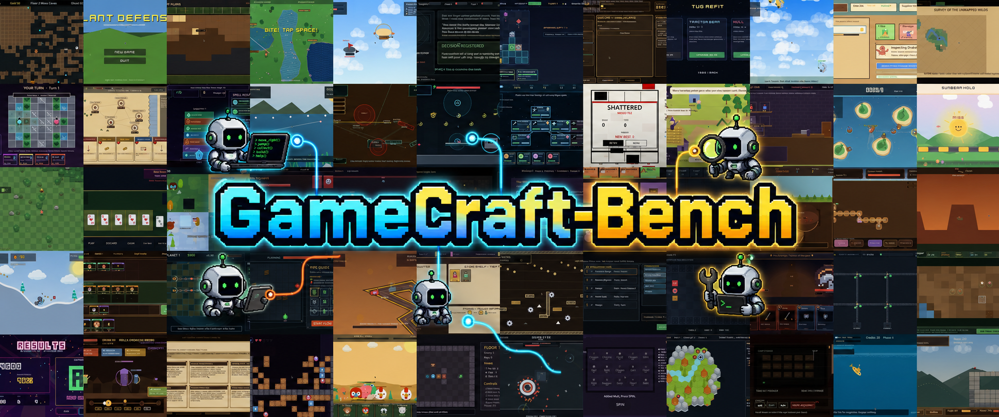

<p align="center">
  
</p>

<p align="center">
  <a href="https://tongxuluo.github.io/gamecraft-bench-website">Website</a> •
  <a href="https://tongxuluo.github.io/gamecraft-bench-website/#citation">Paper</a> •
  <a href="https://tongxuluo.github.io/gamecraft-bench-website/#demos">Demos</a>
</p>

**GameCraft-Bench: Can Agents Build Playable Games End-to-End in a Real Game Engine?**

GameCraft-Bench evaluates whether coding agents can transform natural-language game specifications into complete, playable Godot projects.
Unlike traditional coding tasks, game generation depends on scripts, scenes, assets, rendering, runtime configuration, and player-game interaction working together as one executable system.

The benchmark contains **140 tasks** across **15 game families**.
Each agent must submit a complete Godot project together with replayable demonstration traces.
The verifier launches the project, replays the traces, records gameplay evidence, and scores observed play with a hidden rubric and multimodal judge.

The benchmark runs on top of [Harbor](https://github.com/harbor-framework/harbor) and ships with a custom local-subprocess environment for Docker-less hosts.

---

## Benchmark overview

GameCraft-Bench is organized around three desiderata for end-to-end game generation:

- **Engine Grounding**: games are generated and evaluated inside a concrete game engine and runtime environment.
- **Artifact Completeness**: agents must deliver complete launchable game projects rather than isolated scripts, scenes, or assets.
- **Interactive Verification**: games are judged by observed behavior under player input, using replayed demonstrations as standardized gameplay evidence.

The task suite covers diverse 2D game-generation demands, including continuous control and collision, rule and state management, progression and economy, exploration, narrative interaction, and presentation-heavy gameplay.

| Family | Tasks | Family | Tasks | Family | Tasks |
|---|---:|---|---:|---|---:|
| Platformer | 19 | Strategy | 17 | Tycoon | 16 |
| Open-world | 15 | Roguelike | 14 | Visual novel | 11 |
| Puzzle | 8 | Shooter | 7 | Simulation | 6 |
| Card game | 5 | Horror | 5 | Rhythm | 5 |
| Idle | 4 | Racing | 4 | Sports | 4 |

## Main results

Frontier coding agents remain far from reliable end-to-end game generation.
The strongest evaluated configuration reaches only **41.46%** overall, and most agents score below 40%.

| Harness | Model | Overall | Mechanics | Depth | Visuals | Art |
|---|---|---:|---:|---:|---:|---:|
| Claude Code | Opus-4.7 high | **41.46** | **55.34** | **39.48** | **42.78** | **36.86** |
| Codex | GPT-5.5 high | 39.49 | 54.36 | 38.61 | 41.84 | 32.94 |
| Kimi Code | Kimi-K2.6 | 30.65 | 39.76 | 28.07 | 33.66 | 27.99 |
| Claude Code | MiMo-V2.5-Pro | 24.10 | 32.33 | 22.59 | 27.45 | 20.65 |
| Code Buddy | GLM-5.1 | 18.29 | 25.23 | 17.80 | 21.14 | 14.59 |
| Code Buddy | MiniMax-M2.7 | 10.95 | 14.27 | 9.92 | 14.92 | 8.85 |
| Codex | DeepSeek-V4-Pro | 2.15 | 2.25 | 1.69 | 1.97 | 2.63 |

Scores are percentages. Mechanics, Depth, Visuals, and Art correspond to the
four rubric categories: Core Mechanics, Content Depth, Functional Visuals, and
Art and Presentation.

## Evaluation protocol

Each task provides a natural-language game specification, a Godot-based workspace, shared resources, and a hidden rubric.
A valid submission includes a Godot project under `/workspace/game` and replayable input traces under `/workspace/game/demo_outputs/`.
The verifier checks launchability, replays the submitted traces, records gameplay evidence, and applies the hidden rubric to the observed behavior.

## Install

Tested on Ubuntu 22.04. Run as root (or with `sudo`).

### 1. System dependencies

```bash
apt update
DEBIAN_FRONTEND=noninteractive apt-get install -y --no-install-recommends \
    xvfb xdotool ffmpeg x11-utils x11-xserver-utils \
    libxcursor1 libxinerama1 libxrandr2 libxi6 libgl1 libegl1 \
    unzip ca-certificates curl \
    x11vnc novnc
```

These cover everything the verifier and dashboard need:
- `xvfb` — virtual X display for headless replay
- `xdotool` — synthetic mouse / keyboard injection
- `ffmpeg` — screen recording (`x11grab`)
- `x11-utils` / `x11-xserver-utils` — display probes
- `libxcursor1` … `libegl1` — runtime libraries Godot dlopens
- `x11vnc` / `novnc` — browser-based dashboard play sessions

### 2. Godot 4.6.2

Pinned for reproducibility. Direct GitHub download often fails behind the GFW; the `gh-proxy.com` mirror is the easy fallback:

```bash
mkdir -p /opt/godot && cd /opt/godot
curl -sSL -o godot.zip \
    "https://gh-proxy.com/https://github.com/godotengine/godot/releases/download/4.6.2-stable/Godot_v4.6.2-stable_linux.x86_64.zip"
unzip -o godot.zip && rm godot.zip
mv Godot_v4.6.2-stable_linux.x86_64 godot
chmod +x godot
ln -sf /opt/godot/godot /usr/local/bin/godot

godot --version       # → 4.6.2.stable.official.71f334935
```

If the direct link works for you, drop the `gh-proxy.com/` prefix.

### 3. Python

```bash
git clone <this-repo> game-bench && cd game-bench
uv venv --python 3.12 .venv
source .venv/bin/activate
uv pip install -e .          # add --index-url https://pypi.tuna.tsinghua.edu.cn/simple if needed
```

### 4. Local config

```bash
cp .env.example .env         # fill in API keys / paths if defaults aren't right
```

`.env` holds judge API keys (`OPENAI_API_KEY`, `ANTHROPIC_AUTH_TOKEN`, …),
the path to the Godot binary, and any path overrides. All scripts under `scripts/` source it automatically.

### 5. Asset libraries (optional but expected)

Tasks share two CC0 / permissive 2D asset pools, mounted read-only into each trial:

- **Kenney** at `/workspace/assets/library/` — themed packs (sprites, tilesets, UI, audio). ~480 MB across ~157 packs.
- **OpenGameArt** at `/workspace/assets/library-oga/` — narrative / RPG / pixel-art entries scraped from opengameart.org. Per-entry `LICENSE.txt` records the source URL and license string.

```bash
python scripts/fetch_assets.py                              # Kenney
python scripts/fetch_oga_assets.py --license CC0            # OGA, CC0 only
```

Both fetchers are idempotent; safe to re-run.

## Run a task

```bash
./scripts/run.sh -p tasks/<task> --agent <agent>
```

`run.sh` is a thin wrapper around `harbor run` that sources `.env`, activates the venv, sets `PYTHONPATH`, and points harbor at our custom
`LocalSubprocessEnvironment`. Use `--agent oracle` to run the bundled reference solution; `--agent nop` to confirm a do-nothing agent fails (0.0).
All extra arguments are forwarded to Harbor, so `-n`, `-x`, `--job-name`, `--delete`, and `--ak ...` work the same way as in `harbor run`.

For local coding-agent runs, use the dedicated wrappers.
They source `.env`, pin the local agent implementation, forward the required API credentials into the agent subprocess, and default to `--no-delete` so generated projects remain under the job directory for inspection.

```bash
# Claude Code + Opus-4.7
./scripts/run_claude_code_opus_4_7.sh --ak reasoning_effort=high -p tasks/<task>

# Codex CLI + GPT-5.5
./scripts/run_codex_gpt_5_5.sh --ak reasoning_effort=high -p tasks/<task>

# Kimi Code + Kimi coding model
./scripts/run_kimi_code.sh -p tasks/<task>

# Claude Code + MiMo-V2.5-Pro through an Anthropic-compatible endpoint
./scripts/run_claude_code_mimo_2_5.sh --ak reasoning_effort=high -p tasks/<task>
```

Claude Code / Codex-based wrappers require `--ak reasoning_effort=<low|medium|high>`.
The Kimi wrapper passes `--ak thinking=true` by default.

Job artifacts land under `$GAMECRAFT_BENCH_JOBS_ROOT` (default `../gamecraft-bench-jobs/<timestamp>/<task>__<id>/`).

## Dashboard

`gamecraft_bench/dashboard/` is a browser-based dashboard for inspecting benchmark jobs, scores, artifacts, and the playable games agents produce.
When launching a game for interactive inspection, it snapshots the project to a temporary play directory so the agent's retained sandbox is not disturbed.

```bash
./scripts/dashboard_service.sh             # default port 6090, default jobs root
./scripts/dashboard_service.sh --port 7000 --jobs-root /custom/path
```

Forward the port in VS Code (Ports panel), open `http://localhost:6090/`, then either:

- Click **Play** on a single trial, or
- Tick the checkboxes on multiple trials and click **Compare** to open a grid view with one live noVNC iframe per game (auto-laid-out 2/3/4 columns). Each cell has its own Refresh / Stop button and is fully interactive.

Architecture: a session pool of up to 8 X displays (`:300`–`:307`, disjoint from the verifier's `:99`–`:199` range), each backing a dedicated Xvfb + Godot + x11vnc trio. The FastAPI app serves noVNC's static files at `/novnc/` and bridges browser WebSocket frames to x11vnc TCP at `/ws/{sid}`. Closing the browser tab fires `navigator.sendBeacon` to free the slot.

## Adding a task

1. `harbor task init <org>/<task-name>` from the repo root.
2. Move the generated dir under `tasks/`.
3. Fill in `instruction.md` and `tests/rubric.json` (build_check, requirements, score_formula).
4. Optional: write `solution/solve.sh` for the oracle agent.
5. End-to-end check:
   ```bash
   ./scripts/run.sh -p tasks/<task> --agent oracle
   ```

Task assets / starter scaffold go under `tasks/<task>/workspace/`; contents are copied into the agent's `/workspace/` at env start.

## Scope

GameCraft-Bench focuses on 2D game generation in Godot.
This makes the benchmark lightweight and reproducible for headless evaluation, but it does not cover Unity, Unreal, 3D games, multiplayer systems, large-scale physics, or long-form production workflows.
The verifier scores visual gameplay evidence; audio-dependent aspects are represented through visible game behavior rather than direct audio evaluation.

The benchmark measures whether an agent follows the game specification and realizes the requested mechanics, content, visual state, and presentation in an executable artifact.
It does not attempt to measure whether a generated game is subjectively fun.

## Acknowledgment

GameCraft-Bench builds on [Godot](https://github.com/godotengine/godot) as the game engine runtime and [Harbor](https://github.com/harbor-framework/harbor) as the benchmark and agent-execution harness.
We thank the open-source communities behind these projects for making reproducible, end-to-end game-generation evaluation possible.

## Citation

If you find GameCraft-Bench useful, please cite us:

```bibtex
@misc{luo2026gamecraftbench,
  title = {GameCraft-Bench: Can Agents Build Playable Games End-to-End in a Real Game Engine?},
  author = {Tongxu Luo and Rongsheng Wang and Jiaxi Bi and Chenming Xu and Zhengyang Tang and Jianlong Chen and Juhao Liang and Ke Ji and Shuqi Guo and Yuhao Du and Fan Bu and Wenyu Du and Xiaotong Zhang and Kyle Li and Shaobo Wang and Linfeng Zhang and Yuxuan Liu and Xin Lai and Chenxin Li and Yiduo Guo and Zhexin Zhang and Xinyuan Wang and Tianyi Bai and Ziniu Li and Benyou Wang},
  year = {2026},
  url = {https://github.com/tongxuluo/gamecraft-bench}
}
```

## License

Apache-2.0.

## Star History

<a href="https://www.star-history.com/?type=date&repos=tongxuluo%2Fgamecraft-bench">
 <picture>
   <source media="(prefers-color-scheme: dark)" srcset="https://api.star-history.com/chart?repos=tongxuluo/gamecraft-bench&type=date&theme=dark&legend=top-left" />
   <source media="(prefers-color-scheme: light)" srcset="https://api.star-history.com/chart?repos=tongxuluo/gamecraft-bench&type=date&legend=top-left" />
   
 </picture>
</a>
